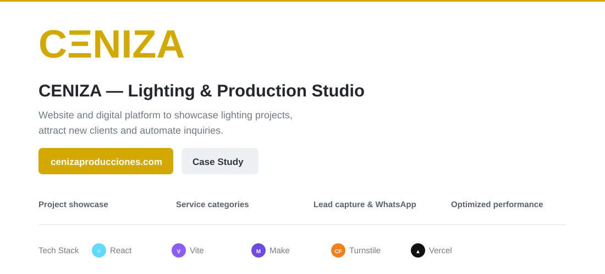

CENIZA is a responsive digital platform for a lighting and production studio. The website combines brand presentation, project storytelling, service discovery and commercial intake in a single customer-facing experience.

The technical goal was to keep the public website visually rich while maintaining a clear security boundary between visitors and the company's private operational systems. Contact and quote requests therefore move through a protected server-side path before reaching automation, while the CRM remains a separate application.

### Core stack
    

### What this project demonstrates

- Responsive product and brand UI in React
- Portfolio-driven content architecture
- Equipment and service discovery
- Secure lead and quote intake
- Serverless boundary between the public site and automation
- Separation of public web traffic from private CRM data
- Static route generation for better discoverability and deployment behavior

### Architecture
~~~mermaid
flowchart LR
    U[Visitor] --> W[React + Vite]
    W --> C[Catalog + services]
    W --> P[Visual portfolio]
    W --> F[Contact / quote]
    F --> API[Vercel Function]
    API --> T[Turnstile]
    T --> M[Make]
    M --> L[Lead + email follow-up]
    CRM[Private CRM] -. separate .-> W
~~~

The website acts as the public discovery and acquisition layer. Visitors can browse the studio's work, understand its services and submit commercial requests, but private operational data never needs to be exposed to the browser.

A serverless endpoint sits between the public form and the automation layer. Cloudflare Turnstile adds abuse protection before validated requests move into Make for internal follow-up.

### Technical highlights

**Frontend architecture.** React components organize the visual experience into reusable sections for projects, services and catalog content. Vite provides the development and production build pipeline.

**Public/private separation.** The website and CRM are intentionally separate systems. The public application captures intent; the private application manages operational records. This reduces coupling and creates a clearer security model.

**Serverless intake.** Contact and quote traffic is routed through a server-side function rather than connecting browser code directly to automation credentials.

**Deployment and discoverability.** The build process includes static route generation so project and service content can be exposed cleanly in production while preserving the React application experience.

<strong>Run locally & repository structure</strong>

~~~bash
npm install
cp .env.example .env.local
npm run dev
~~~

~~~text
src/        UI, catalog, services and portfolio
api/        Secure contact endpoint
server/     Turnstile verification
public/     Public discovery assets
scripts/    Static route generation
docs/       Project notes and architecture
~~~

<strong>Production:</strong> https://www.cenizaproducciones.com/

