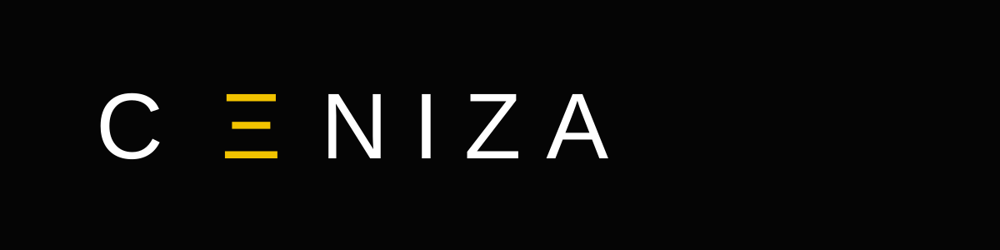

<h1 align="center">CENIZA — Lighting & Production Studio</h1>

<strong>Visual portfolio · equipment rental · service discovery · secure lead capture</strong>

<a href="https://www.cenizaproducciones.com/"><strong>Live website</strong></a> · <a href="https://www.diegofrancoe.com/proyectos/ceniza"><strong>Case study</strong></a>

CENIZA is a responsive digital platform for a lighting studio and equipment-rental business. It brings the brand, services, equipment catalog, lighting packages, visual portfolio and commercial lead capture into one customer-facing experience while keeping private CRM operations separate.

| Project showcase | Service catalog | Lead capture | Optimized experience |
|---|---|---|---|
| Photography + video | Equipment + lighting combos | Secure forms + WhatsApp | Responsive media + SEO |

### Tech stack
    

### Architecture
~~~mermaid
flowchart LR
 U[Visitor] --> W[React + Vite]
 W --> C[Catalog + services]
 W --> P[Visual portfolio]
 W --> F[Contact / quote]
 F --> API[Vercel Function]
 API --> T[Turnstile]
 T --> M[Make]
 M --> L[Lead + email follow-up]
 CRM[Private CRM] -. separate .-> W
~~~

<strong>Run locally & repository structure</strong>

~~~bash
npm install
cp .env.example .env.local
npm run dev
~~~

~~~text
src/        UI, catalog, services and portfolio
api/        Secure contact endpoint
server/     Turnstile verification
public/     Public discovery assets
docs/       Project notes
~~~

<strong>Production:</strong> https://www.cenizaproducciones.com/

